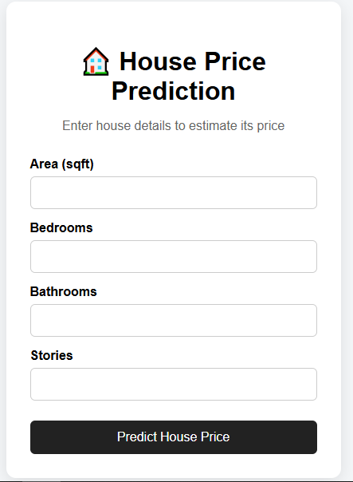
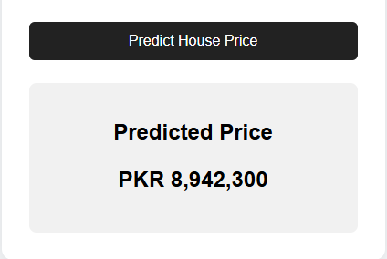

# 🏠 House Price Prediction

A machine learning project that predicts house prices based on basic property features such as area, bedrooms, bathrooms, and stories.

The project includes Exploratory Data Analysis (EDA), Linear Regression model development, model evaluation, and a Flask web application for making predictions.

---

## 📌 Project Overview

The objective of this project is to analyze the factors affecting house prices and understand the relationships between different house features and price.

After performing EDA, a Linear Regression model is trained to predict house prices. The trained model is then integrated into a Flask web application where users can enter house details and receive an estimated price.

---

## 🎯 Objectives

- Perform Exploratory Data Analysis (EDA)
- Check data quality and missing values
- Analyze relationships between house features and price
- Identify correlations between variables
- Train a Linear Regression model
- Evaluate model performance
- Save the trained machine learning model
- Build a Flask web application
- Predict the price of a new house through a web interface

---

## 📊 Dataset

The dataset contains **40 house records** and **5 columns**.

### Features

| Feature | Description |
|---|---|
| `area_sqft` | Area of the house in square feet |
| `bedrooms` | Number of bedrooms |
| `bathrooms` | Number of bathrooms |
| `stories` | Number of stories |

### Target Variable

| Variable | Description |
|---|---|
| `price_pkr` | House price in Pakistani Rupees (PKR) |

---

## 🔎 Exploratory Data Analysis

The following EDA steps were performed:

- Dataset shape and structure
- Data types
- Missing value analysis
- Duplicate value analysis
- Descriptive statistics
- Feature distributions
- Outlier analysis
- Area vs. price analysis
- Bedrooms vs. price analysis
- Bathrooms vs. price analysis
- Stories vs. price analysis
- Correlation analysis
- Correlation heatmap

### Key EDA Findings

- The dataset contains no missing values.
- No duplicate records were found.
- `area_sqft` has a very strong positive relationship with `price_pkr`.
- Bedrooms and bathrooms also show strong positive relationships with price.
- `stories` has a weaker positive relationship with price compared with the other features.
- The dataset contains only 40 observations, so the results should be interpreted within the context of this dataset.

---

## 🤖 Machine Learning Model

### Algorithm

**Linear Regression**
## Screen-shot 



### Input Features

```text
area_sqft
bedrooms
bathrooms
stories
Target
price_pkr

The dataset was divided into:

80% training data
20% testing data

The model was trained using the training set and evaluated using the testing set.

📈 Model Performance

The Linear Regression model achieved the following results on the test set:

Metric	Result
MSE	6,603,528,111.57
RMSE	81,262.10 PKR
R² Score	0.999787

The Actual vs. Predicted Price plot and residual analysis were also used to evaluate the model.

Note: The high R² score should not be interpreted as 99.98% real-world prediction accuracy. The dataset contains only 40 observations and may not represent the wider housing market.

🏠 Example Prediction

The trained model was used to predict the price of a new house with:

Area       = 820 sqft
Bedrooms   = 4
Bathrooms  = 3
Stories    = 2

Predicted price:

≈ PKR 8,089,401

This is a model estimate and should not be considered a guaranteed market price.

🌐 Flask Web Application

The trained machine learning model is integrated into a Flask web application.

The user enters:

Area
Bedrooms
Bathrooms
Stories

The Flask application sends these values to the trained Linear Regression model and displays the predicted house price.

Application Flow
User Input
     ↓
Flask Web Application
     ↓
Trained Linear Regression Model
     ↓
Price Prediction
     ↓
Result Display
📁 Project Structure
House-Price_prediction/
│
├── .venv/
│
├── data/
│   └── house_data.csv
│
├── notebook/
│   └── house_price_prediction.ipynb
│
├── model/
│   └── house_price_model.pkl
│
├── templates/
│   └── index.html
│
├── static/
│   └── style.css
│
├── app.py
├── train_model.py
├── requirements.txt
└── README.md
⚙️ Installation
1. Clone the repository
git clone <YOUR-GITHUB-REPOSITORY-URL>
2. Open the project
cd House-Price_prediction
3. Create a virtual environment
python -m venv .venv
4. Activate the virtual environment
Windows
.venv\Scripts\activate
5. Install dependencies
pip install -r requirements.txt
▶️ Train the Model

Run:

python train_model.py

This will:

Load the dataset
Select the required features
Train the Linear Regression model
Save the trained model

The trained model will be saved as:

model/house_price_model.pkl
🚀 Run the Flask Application

After training the model, run:

python app.py

The application will start at:

http://127.0.0.1:5000

Open the address in your web browser.

🛠️ Technologies Used
Python
Pandas
NumPy
Matplotlib
Seaborn
Scikit-learn
Flask
Joblib
HTML
CSS
Jupyter Notebook


🔮 Future Improvements

The current project is a machine learning learning/portfolio project. It can be improved by:

Using a larger real-world housing dataset
Adding more property features
Adding cross-validation
Comparing multiple regression algorithms
Performing multicollinearity analysis
Adding stronger input validation
Improving the Flask UI
Adding interactive visualizations
Deploying the application online
Adding a database for property records

⚠️ Limitations
The dataset contains only 40 observations.
The model uses a limited number of house features.
The predicted price is an estimate, not a guaranteed market value.
Model performance on this dataset may not generalize to other housing markets or larger datasets.

👩‍💻 Author

Nimra Nazir

BS Computer Science Student

Interested in:

Artificial Intelligence
Machine Learning
Python
Web Development
AI Engineering
📜 License

This project is created for educational and portfolio purpose.